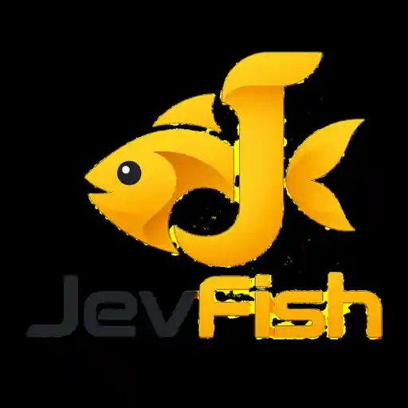
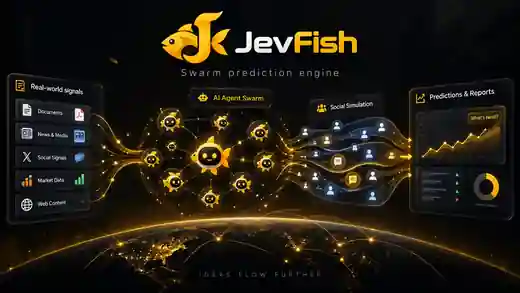

<div align="center">



# JevFish

### System-One / System-Two 混合群体模拟引擎

**让 Jev 处理高频行为决策，只在真正需要语言时调用生成式模型。**

[English README](./README.md) · [技术说明](./JEVFISH.md)

</div>

<div align="center">

</div>

## 项目简介

JevFish 是一个建立在 MiroFish 与 CAMEL-AI OASIS 之上的实验性混合群体模拟项目。

传统生成式 Agent 模拟通常会把每一次活跃 Agent 回合都交给大语言模型。JevFish 尝试把这类工作拆成两层：

- **System One / TypeSafe Jev**：负责点赞、关注、转发、忽略、是否发言等高频、结构化行为决策，以及目标选择。
- **System Two / 生成式模型**：只在 Agent 已经决定需要写帖子、评论或引用内容时生成自然语言；低置信度时也可以回退到完整 OASIS LLM Agent。
- **OASIS**：继续负责社交平台、推荐系统、关系网络、动作执行与模拟时钟。
- **MiroFish**：保留世界构建、图谱记忆、模拟流程与报告等上层基础能力。

JevFish 的研究问题不是“能不能把 LLM 全部替换掉”，而是：**在保持足够行为相似度的前提下，有多少高频 Agent 决策可以交给更快、更受约束的 System-One 模型？**

> JevFish 是模拟与实验系统，不是现实世界预言机。模拟世界中的频率不等同于经过校准的现实概率，除非另外使用真实、留出数据完成验证。

## 当前状态

主分支已经实现：

- Jev 多动作行为规划；
- 每个动作独立目标选择；
- OASIS `ManualAction[]` 直接执行；
- 仅针对语言动作调用 System Two；
- `llm` / `hybrid` / `jev` 三种运行模式；
- Twitter 与 Reddit 模拟入口；
- 自适应、按动作划分的置信度阈值；
- Jev / System-Two / fallback 指标；
- Hybrid 与原始 LLM-only OASIS 的 A/B benchmark；
- 可复现种子与重复配对实验工具；
- provider-backed GitHub Actions 测试。

## 快速开始

```bash
cp .env.example .env
npm run setup:all
npm run dev
```

核心环境变量：

```env
TYPESAFE_API_KEY=...
TYPESAFE_DEFAULT_MODEL=jev-latest

LLM_API_KEY=...
LLM_BASE_URL=https://openrouter.ai/api/v1
LLM_MODEL_NAME=meta/muse-spark-1.3-contributor

JEVFISH_DECISION_ENGINE=hybrid
JEVFISH_POLICY_MODE=multi
JEVFISH_CONFIDENCE_THRESHOLD=0.58
JEVFISH_GENERATIVE_CONFIDENCE_THRESHOLD=0.72
```

完整安装、benchmark、指标定义、当前实验限制与研究路线请以 **[README.md](./README.md)** 为准。

## 上游与许可

JevFish 源自 **[MiroFish](https://github.com/666ghj/MiroFish)**，社交模拟运行时使用 **[CAMEL-AI OASIS](https://github.com/camel-ai/oasis)**，System-One 决策层使用 **[TypeSafe AI Jev](https://typesafe.ai/)**。

本仓库继续遵循 **AGPL-3.0** 许可。再分发修改版本时请保留必要的上游声明并遵守对应许可条款。
