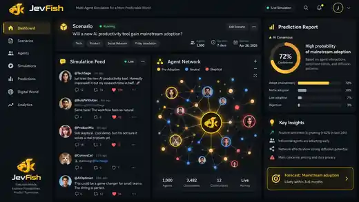
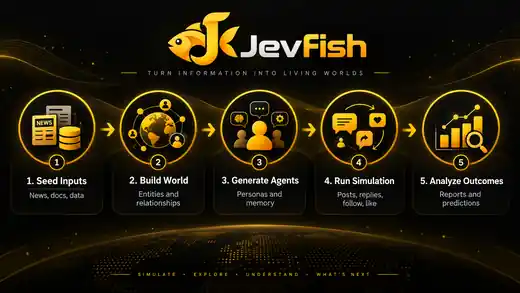

<div align="center">


# JevFish

### A hybrid swarm simulation engine for exploring possible futures

**Fast System-One behavior. Generative language only when it matters.**

[](https://typesafe.ai/)
[](https://github.com/camel-ai/oasis)
[](https://www.python.org/)
[](./LICENSE)

JevFish turns real-world seed information into a simulated society of agents, then uses **TypeSafe Jev** for high-frequency behavioral decisions and a generative model only when language or deeper reasoning is required.

</div>

<div align="center">

</div>

> [!IMPORTANT]
> JevFish is a simulation and experimentation system, not an oracle. Frequencies observed across simulated worlds are model-conditioned outcomes, not calibrated real-world probabilities unless they are separately validated against held-out observations.

## ⚡ Overview

Traditional generative-agent simulations often spend a full LLM turn on every small choice: whether an agent should like something, ignore it, follow someone, repost, comment, or write a new post.

JevFish separates those responsibilities.

- **System One — Jev:** fast typed behavioral planning, action gating, and target selection.
- **System Two — Generative model:** used only when actual language or deeper reasoning is needed.
- **OASIS — World runtime:** executes the social actions, network effects, and environment dynamics.
- **MiroFish foundation:** world construction, graph-memory, reporting, and simulation workflow.

The goal is simple: **run richer populations and more independent worlds without paying full generative-agent cost for every micro-decision.**

## 🌍 Our Vision

JevFish is designed around one question:

> What if large social simulations behaved more like real cognition — mostly fast reactions, with expensive reasoning used only when necessary?

That gives us a path toward simulations that can scale in three directions:

- **More agents** — larger populations under the same compute budget.
- **More rounds** — longer social evolution without multiplying full LLM calls.
- **More worlds** — repeated stochastic rollouts for counterfactual and Monte Carlo analysis.

The long-term objective is not one deterministic prediction. It is to understand which outcomes are **stable, fragile, or sensitive to interventions** across many simulated worlds.

## 🖥️ Product Direction

<div align="center">

</div>

> The dashboard above is a product-direction mockup illustrating the experience JevFish is moving toward: scenario setup, live agent activity, network evolution, and outcome analysis in one interface. The simulation runtime described below is already implemented; this exact UI is not presented as a production screenshot.

## 🔄 Workflow

<div align="center">

</div>

JevFish follows a five-stage workflow:

1. **Seed Inputs** — ingest documents, reports, news, structured data, or scenario context.
2. **Build the World** — extract entities, relationships, memory, and graph context.
3. **Generate Agents** — construct personas, attributes, social relationships, and activity profiles.
4. **Run Simulation** — agents interact inside OASIS using the JevFish hybrid decision engine.
5. **Analyze Outcomes** — inspect traces, network changes, behavioral distributions, and reports.

## 🧠 The JevFish Runtime

```text
active OASIS agent
       │
       ▼
persona + recent context
       │
       ▼
      Jev
 one typed behavior plan
       │
       ├─ like? + target ───────────┐
       ├─ repost? + target ─────────┤
       ├─ follow? + target ─────────┤
       ├─ dislike? + target ────────┼─→ OASIS ManualAction[]
       │                            │
       ├─ create post? ─────────────┤
       ├─ quote? + target ──────────┤
       └─ comment? + target ────────┘
                    │
                    ▼
       language required?
          │              │
         no             yes
          │              │
          ▼              ▼
      execute       System Two writes
      directly       only the text

low-confidence plan ───────────────→ full OASIS LLMAction fallback
```

### V0.2 multi-action policy

The default `multi` policy asks Jev several typed questions in one request. One simulated agent can therefore perform a sparse bundle of actions during the same OASIS tick.

For example:

```text
like post_17        0.91  → execute directly
follow user_4       0.74  → execute directly
repost post_12      0.22  → skip
quote post_17       0.79  → ask System Two for text only
```

This is intentionally different from handing the whole turn back to an unrestricted generative agent.

## ✨ Why JevFish

| Conventional generative-agent loop | JevFish |
|---|---|
| Full LLM turn for every agent decision | Jev plans bounded behavior |
| Behavior and language are coupled | Behavior and language are separated |
| Simple likes/follows can require expensive inference | Simple actions execute directly |
| Scaling agents often scales LLM usage almost linearly | More decisions can stay on System One |
| One expensive world is common | Designed toward many stochastic worlds |

## 🎛️ Execution Modes

| Mode | Behavior |
|---|---|
| `llm` | Baseline OASIS behavior. Intercepted `LLMAction()` requests remain full generative-agent turns. |
| `hybrid` | **Recommended.** Jev plans behavior; System Two materializes selected language; uncertainty can escalate to the original LLM agent. |
| `jev` | Structured stress-test mode focused on Jev-driven actions. |

Policy mode is configured separately:

| Policy | Behavior |
|---|---|
| `multi` | **Default.** One Jev plan can produce multiple actions with independent targets. |
| `single` | Preserved V0.1 one-action router for compatibility and ablation experiments. |

## ✅ Current Status

**JevFish V0.2 is implemented on `main`.**

Current runtime capabilities include:

- official TypeSafe Jev Python SDK integration;
- multi-action behavior planning in a single Jev request;
- independent target selection for social actions;
- direct OASIS `ManualAction` bundles;
- targeted System-Two text generation for posts, quotes, and comments;
- confidence-based full-agent escalation;
- `llm`, `hybrid`, and `jev` execution modes;
- Twitter and Reddit runtime wrappers;
- retry handling for empty reasoning-model responses;
- per-platform Jev/System-Two/fallback metrics;
- controlled hybrid-vs-LLM A/B benchmark tooling;
- provider-backed GitHub Actions tests;
- preserved legacy simulator entrypoints for baseline comparisons.

## 📊 Benchmarking the Thesis

JevFish includes a controlled A/B runner that starts the same synthetic society twice:

```text
A  JevFish hybrid + multi-action policy
B  original LLM-only OASIS policy
```

The benchmark measures:

- simulation-loop runtime;
- Jev calls and plans;
- direct manual actions;
- constrained System-Two requests;
- retries and empty responses;
- full OASIS LLM fallbacks;
- action distributions from SQLite traces;
- likes, follows, quotes, reposts, and generated posts;
- descriptive action-distribution similarity between policies.

A recent small provider-backed test demonstrated that JevFish can replace full LLM agent turns with typed Jev plans and targeted text generation. It also exposed the current bottleneck: if Jev selects too many language-heavy actions, System-Two latency can erase the speed advantage. That is why the next work focuses on **policy calibration**, not headline speed claims.

Run the benchmark yourself:

```bash
export TYPESAFE_API_KEY=...
export LLM_API_KEY=...
export LLM_BASE_URL=https://openrouter.ai/api/v1
export LLM_MODEL_NAME=meta/muse-spark-1.3-contributor

python benchmarks/jevfish_ab.py \
  --agents 10 \
  --rounds 3 \
  --threshold 0.58 \
  --max-actions 3
```

> [!NOTE]
> A short constrained text-generation request and a full OASIS generative-agent turn are different workloads. JevFish reports them separately instead of presenting them as equivalent "LLM calls."

## 🚀 Quick Start

### Prerequisites

| Tool | Version | Purpose |
|---|---:|---|
| Node.js | 18+ | Frontend runtime |
| Python | 3.11–3.12 | Backend runtime |
| `uv` | latest | Python environment/package management |
| TypeSafe API key | — | Jev System-One decisions |
| OpenAI-compatible LLM key | — | System-Two language generation |
| Zep Cloud key | — | Full graph-memory pipeline |

### 1. Configure environment variables

```bash
cp .env.example .env
```

Core configuration:

```env
# System Two
LLM_API_KEY=...
LLM_BASE_URL=https://openrouter.ai/api/v1
LLM_MODEL_NAME=meta/muse-spark-1.3-contributor

# System One
TYPESAFE_API_KEY=...
TYPESAFE_DEFAULT_MODEL=jev-latest

# JevFish
JEVFISH_DECISION_ENGINE=hybrid
JEVFISH_POLICY_MODE=multi
JEVFISH_CONFIDENCE_THRESHOLD=0.58
JEVFISH_MAX_CONTEXT_POSTS=12
JEVFISH_MAX_ACTIONS_PER_AGENT=3
JEVFISH_MAX_SYSTEM_TWO_ACTIONS=1
JEVFISH_SAMPLE_PROBABILITIES=true

# Graph memory
ZEP_API_KEY=...
```

For deterministic A/B experiments:

```env
JEVFISH_SAMPLE_PROBABILITIES=false
```

For many-world stochastic rollouts, enable probability sampling.

### 2. Install dependencies

```bash
npm run setup:all
```

### 3. Start JevFish

```bash
npm run dev
```

Default services:

```text
frontend  http://localhost:3000
backend   http://localhost:5001
```

### Docker

```bash
cp .env.example .env
docker compose up -d
```

## 📈 Runtime Metrics

Every simulation writes per-platform JevFish metrics:

```text
jevfish_twitter_metrics.json
jevfish_reddit_metrics.json
```

Important fields include:

```text
jev_calls
jev_plans
jev_manual_actions
multi_action_agents
llm_fallbacks
llm_escalations
system_two_requests
system_two_calls
system_two_retries
system_two_empty_responses
system_two_errors
system_two_latency_ms
manual_by_type
selected_by_type
```

These metrics are meant to make the hybrid policy inspectable rather than hiding provider usage behind one aggregate number.

## 🌐 Many Possible Worlds

JevFish is being built toward repeated stochastic simulation rather than a single "answer."

```text
                         same initial state
                                │
                ┌───────────────┼───────────────┐
                ▼               ▼               ▼
             world 1         world 2         world 3
                │               │               │
             JevFish         JevFish         JevFish
                │               │               │
                └───────────────┼───────────────┘
                                ▼
                   outcome distributions
                                │
                   stable / fragile / sensitive
```

Future experiments will add explicit belief state, calibrated activity policies, Monte Carlo rollouts, and intervention branches.

## 🏗️ Repository Architecture

```text
backend/scripts/
├── jevfish_runtime.py                 # System-One planning + OASIS proxy
├── jevfish_system_two.py              # bounded text generation + retry metrics
├── run_twitter_simulation.py          # JevFish Twitter entrypoint
├── run_twitter_simulation_legacy.py   # preserved upstream simulator
├── run_reddit_simulation.py           # JevFish Reddit entrypoint
├── run_reddit_simulation_legacy.py    # preserved upstream simulator
├── run_parallel_simulation.py         # JevFish parallel entrypoint
└── run_parallel_simulation_legacy.py  # preserved upstream simulator

benchmarks/
└── jevfish_ab.py                      # controlled hybrid-vs-LLM experiment

tests/
├── test_jevfish_runtime.py
├── test_jevfish_system_two.py
└── test_jevfish_benchmark.py
```

For deeper implementation notes, metrics definitions, caveats, and research direction, see [`JEVFISH.md`](./JEVFISH.md).

## 🧪 Research Roadmap

The immediate research questions are empirical:

1. How much full generative-agent computation can be removed at a given behavioral-similarity target?
2. Which social actions belong safely in System One?
3. How should confidence thresholds vary by action type?
4. Can belief and activity state improve long-horizon population dynamics?
5. How many more independent worlds can the hybrid runtime execute under a fixed budget?
6. Can simulated distributions be calibrated against held-out real observations?

The next engineering milestone is **action-specific calibration**: make language-heavy actions more selective while preserving the social behavior of the LLM baseline.

## 🙏 Acknowledgments

JevFish began as a fork of **[MiroFish](https://github.com/666ghj/MiroFish)** and preserves its world-construction, graph-memory, simulation, interaction, and reporting foundation.

The social environment is powered by **[CAMEL-AI OASIS](https://github.com/camel-ai/oasis)**, and the System-One decision layer is built with **[TypeSafe AI Jev](https://typesafe.ai/)**.

JevFish is distributed under the repository's **AGPL-3.0** license. Please retain upstream notices and comply with the license when redistributing modified versions.

---

<div align="center">

**JevFish — simulate minds, explore possibilities, measure what changes.**

</div>
