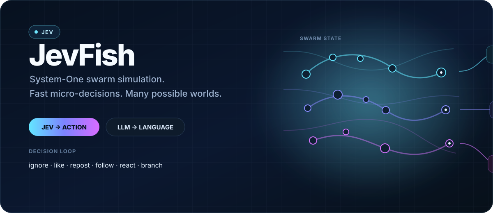
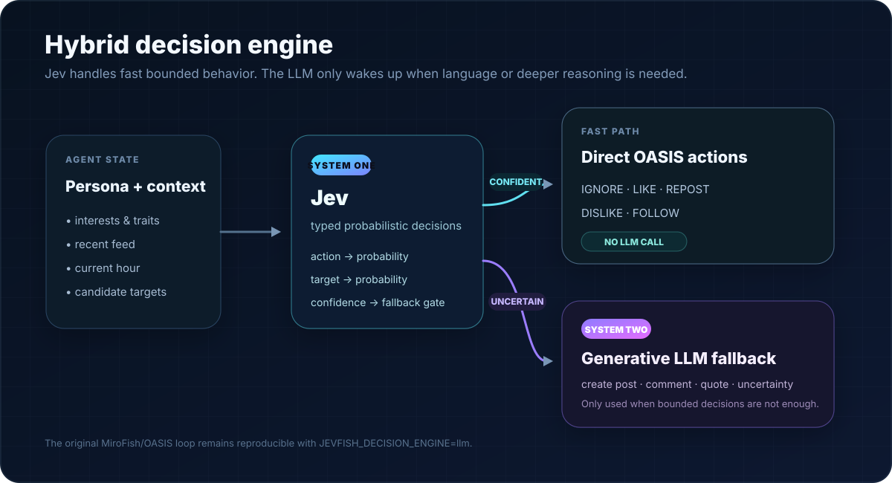
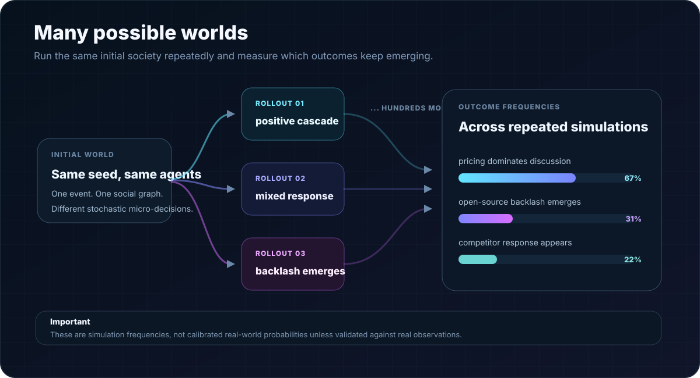

<div align="center">



# JevFish

### Fast behavior. Generative language only when it matters.

[](https://typesafe.ai/)
[](https://github.com/camel-ai/oasis)
[](https://www.python.org/)
[](./LICENSE)

**JevFish is an experimental hybrid social-simulation runtime that uses TypeSafe Jev as a fast System-One behavioral policy and a generative model only for language or genuinely uncertain turns.**

</div>

A simulated person does not need a full generative-agent turn to decide every like, follow, repost, or no-op. JevFish separates **behavior selection** from **language generation** so more of the simulation budget can go toward agents, rounds, and independent rollouts.

> [!IMPORTANT]
> JevFish is a simulation system, not an oracle. Frequencies observed across simulated worlds are model-conditioned simulation frequencies, not calibrated real-world probabilities unless separately validated against held-out observations.

## How it works

<div align="center">

</div>

```text
active OASIS agent
       │
       ▼
persona + recent feed
       │
       ▼
      Jev
 one parallel plan
       │
       ├─ refresh? ───────────────┐
       ├─ like? + target ─────────┤
       ├─ repost? + target ───────┤
       ├─ follow? + target ───────┼─→ OASIS ManualAction[]
       ├─ dislike? + target ──────┤
       │                          │
       ├─ create post? ───────────┼─→ System Two writes only the text
       ├─ quote? + target ────────┤
       └─ comment? + target ──────┘

low-confidence plan ───────────────→ full OASIS LLMAction fallback
```

### V0.2: multi-action policy

The default `multi` policy asks Jev several typed questions in one request. Each behavior has its own gate and, where needed, its own target decision. One agent can therefore like a post, follow its author, and create a post during the same OASIS tick without asking a generative model to choose those behaviors.

For actions that actually require language, Jev stays in control of the behavior:

```text
Jev chooses QUOTE + post_17
             │
             ▼
System Two generates commentary only
             │
             ▼
OASIS executes targeted QUOTE_POST
```

This is different from handing the whole turn back to an unrestricted LLM agent.

OASIS already supports a list of actions for one agent in one timestep, so JevFish bundles execute without advancing the simulation clock once per micro-action.

## Decision modes

| Mode | Behavior |
|---|---|
| `llm` | Exact OASIS baseline: intercepted `LLMAction()` requests remain full LLM agent turns. |
| `hybrid` | **Recommended.** Jev plans behavior; System Two materializes selected language; uncertainty can escalate to the original LLM agent. |
| `jev` | Structured stress-test mode with no required generative fallback. |

Policy mode is separate:

| Policy | Behavior |
|---|---|
| `multi` | **Default.** One Jev plan can produce a sparse bundle of actions and independent targets. |
| `single` | Preserved V0.1 one-action router for compatibility and ablations. |

## Status

**V0.2 is on `main`.**

Implemented:

- TypeSafe Jev integration through the official Python SDK;
- multi-action behavior planning in one Jev call;
- independent target selection for social actions;
- direct OASIS `ManualAction` bundles;
- targeted System-Two text generation for posts, quotes, and Reddit comments;
- confidence-based full-agent escalation;
- `llm`, `hybrid`, and `jev` execution modes;
- `multi` and preserved `single` policy modes;
- Twitter and Reddit runtime wrappers;
- per-platform metrics separating Jev plans, constrained text requests, and full LLM fallbacks;
- controlled hybrid-vs-LLM A/B benchmark harness;
- provider-backed GitHub Actions tests plus fast unit CI;
- original simulator bodies preserved as `*_legacy.py` for baseline comparisons.

## Configuration

Copy the example environment:

```bash
cp .env.example .env
```

Core configuration:

```env
# System Two / OpenAI-compatible endpoint
LLM_API_KEY=...
LLM_BASE_URL=https://openrouter.ai/api/v1
LLM_MODEL_NAME=meta/muse-spark-1.3-contributor

# System One / TypeSafe Jev
TYPESAFE_API_KEY=...
TYPESAFE_DEFAULT_MODEL=jev-latest

JEVFISH_DECISION_ENGINE=hybrid
JEVFISH_POLICY_MODE=multi
JEVFISH_CONFIDENCE_THRESHOLD=0.58
JEVFISH_MAX_CONTEXT_POSTS=12
JEVFISH_MAX_ACTIONS_PER_AGENT=3
JEVFISH_MAX_SYSTEM_TWO_ACTIONS=1
JEVFISH_SAMPLE_PROBABILITIES=true

# Existing graph-memory pipeline
ZEP_API_KEY=...
```

Use `JEVFISH_SAMPLE_PROBABILITIES=false` for deterministic A/B experiments. Enable sampling for stochastic many-world rollouts.

## Run JevFish

Requirements:

- Node.js 18+
- Python 3.11–3.12
- `uv`
- TypeSafe API key
- OpenAI-compatible LLM key
- Zep Cloud key for the full graph-memory pipeline

Install and start:

```bash
npm run setup:all
npm run dev
```

Default services:

```text
frontend  http://localhost:3000
backend   http://localhost:5001
```

## Benchmark the thesis

JevFish includes a controlled A/B runner that starts the same synthetic society twice:

```text
A  hybrid + multi-action Jev policy
B  original LLM-only OASIS policy
```

Run:

```bash
export TYPESAFE_API_KEY=...
export LLM_API_KEY=...
export LLM_BASE_URL=https://openrouter.ai/api/v1
export LLM_MODEL_NAME=meta/muse-spark-1.3-contributor

python benchmarks/jevfish_ab.py \
  --agents 10 \
  --rounds 3 \
  --threshold 0.58 \
  --max-actions 3
```

The JSON report records:

- simulation-loop and total runtime;
- Jev calls/plans;
- direct manual actions;
- constrained System-Two provider requests, successes, retries, and failures;
- full OASIS LLM agent fallbacks;
- action distributions from the SQLite trace;
- posts, follows, likes, quotes, and reposts;
- action-distribution similarity between the hybrid and LLM policies.

The benchmark deliberately reports constrained text requests and full LLM agent turns separately. A short text materialization request is not the same workload as an OASIS `LLMAction()` turn.

## Metrics

Each simulation writes:

```text
jevfish_twitter_metrics.json
jevfish_reddit_metrics.json
```

Important fields include:

```text
jev_calls
jev_plans
jev_manual_actions
multi_action_agents
llm_fallbacks
llm_escalations
system_two_requests
system_two_calls
system_two_retries
system_two_errors
manual_by_type
selected_by_type
```

## Many possible worlds

<div align="center">

</div>

The larger goal is not one deterministic prediction. It is running many independent worlds under the same starting state and measuring which simulated outcomes are stable versus fragile.

```text
                     same initial world
                            │
          ┌─────────────────┼─────────────────┐
          ▼                 ▼                 ▼
       rollout 1         rollout 2         rollout 3
          │                 │                 │
         Jev               Jev               Jev
          │                 │                 │
          └─────────────────┼─────────────────┘
                            ▼
                  outcome distributions
```

Future experiments will add explicit belief state, activity policies, repeated Monte Carlo worlds, and counterfactual intervention branches.

## Architecture

```text
backend/scripts/
├── jevfish_runtime.py                 # System-One planning + OASIS proxy
├── jevfish_system_two.py              # bounded text generation + retry metrics
├── run_twitter_simulation.py          # JevFish Twitter entrypoint
├── run_twitter_simulation_legacy.py   # preserved upstream simulator
├── run_reddit_simulation.py           # JevFish Reddit entrypoint
├── run_reddit_simulation_legacy.py    # preserved upstream simulator
├── run_parallel_simulation.py         # JevFish parallel entrypoint
└── run_parallel_simulation_legacy.py  # preserved upstream simulator

benchmarks/
└── jevfish_ab.py                      # controlled hybrid-vs-LLM experiment

tests/
├── test_jevfish_runtime.py
├── test_jevfish_system_two.py
└── test_jevfish_benchmark.py
```

For the deeper research notes, metrics definitions, caveats, and roadmap, see [`JEVFISH.md`](./JEVFISH.md).

## Research direction

The next questions are empirical:

1. How much full generative-agent computation can JevFish remove at a given behavioral similarity target?
2. Which actions are safe to keep at System-One fidelity, and which require deeper reasoning?
3. Can explicit belief and activity state improve population dynamics without turning every agent back into an LLM?
4. How many more independent worlds can the hybrid architecture run under the same time/cost budget?
5. Can those simulated distributions be calibrated against held-out observations?

## Upstream foundations

JevFish began as a fork of **MiroFish**, preserving its world construction, graph-memory, simulation, interview, and reporting foundation while replacing the high-frequency agent-decision path with JevFish's hybrid runtime.

It also builds directly on **CAMEL-AI OASIS** for the social simulation environment and **TypeSafe AI Jev** for typed System-One decisions.

Please retain upstream notices and comply with the repository's **AGPL-3.0** license when redistributing modified versions.
